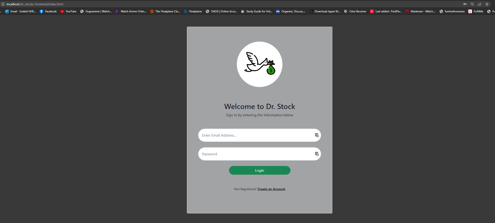
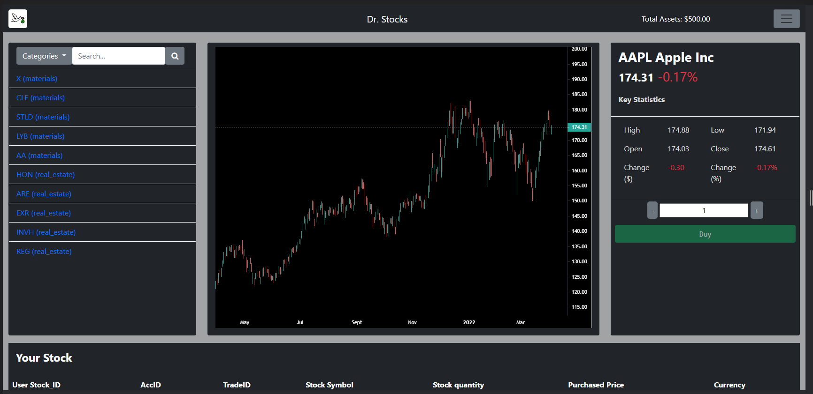

# Dr Stocks Frontend Setup Guide
How to setup frontend services?
1. Unzip the zip file into a folder
2. Copy the frontend folder to the "www" folder in your "wamp64" folder on your C: drive
3. Next, make sure that your WAMPServer is running
4. Enter this URL in your browser:
http://localhost/dr_stocks-frontend/index.html

5. You can then login using this account details:
    
    Email: maryesther@gmail.com
    
    Password: temp1
6. Next, you will be greeted with this main page

*Note if you did not get redirected to the main/dashboard page, this may be due microservices still in the starting up process or KONG api gateway establishing the services and routes. Thus, please wait for around 1 minute before trying to log in again.

With this, you have successfully setup this project and please feel free to try out this project!